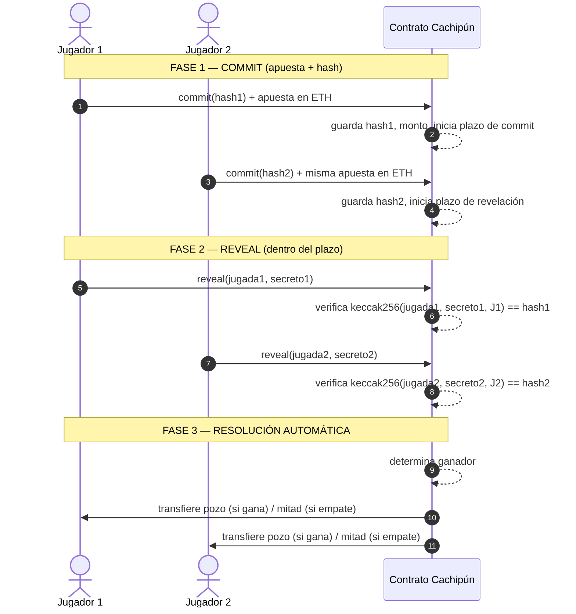
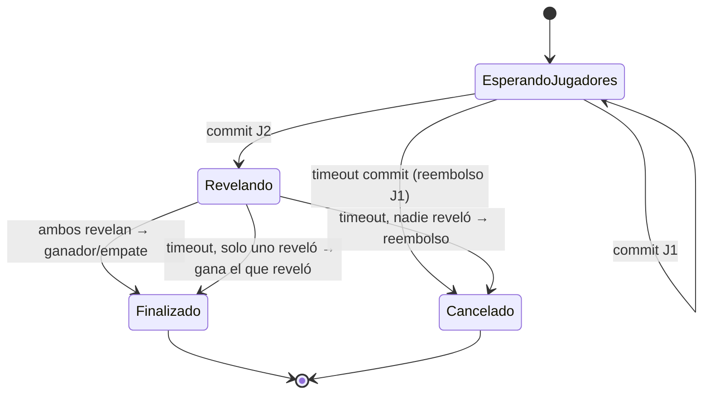

# Cachipún On-Chain — Contrato Inteligente

Evaluación Parcial N°2 · **BCY0010 Fundamentos de Blockchain** · Duoc UC

Contrato inteligente en Solidity que permite a dos jugadores jugar **cachipún (piedra, papel o tijera)** apostando Ether, usando el esquema **commit–reveal** para que ninguno pueda ver la jugada del otro antes de comprometerse.

---

## 1. Flujo del juego



### Paso a paso

| # | Paso | Quién | Qué ocurre en el contrato |
|---|------|-------|---------------------------|
| 1 | **Generar hash** (off-chain) | Cada jugador | Calcula `keccak256(abi.encodePacked(jugada, secreto, direccion))`. La jugada y el secreto **no** salen de su equipo. |
| 2 | **Commit + apuesta** | Jugador 1 | Llama `commit(hash)` enviando ETH (`msg.value`). Queda registrado como jugador 1. |
| 3 | **Commit + apuesta** | Jugador 2 | Llama `commit(hash)` con el **mismo monto**. Al completarse ambos commits empieza el plazo de revelación. |
| 4 | **Reveal** | Ambos | Llaman `reveal(jugada, secreto)`. El contrato recalcula el hash y lo compara con el guardado. Si no coincide, la transacción se revierte. |
| 5 | **Resolución** | Automática | Cuando ambos revelaron, el contrato calcula el ganador y transfiere el pozo. |
| 6 | **Timeout** | Cualquiera | Vencido el plazo, se llama `reclamarTimeout()` y se aplican las reglas de abajo. |

### Reglas de término

| Situación | Resultado |
|-----------|-----------|
| Ambos revelan, hay ganador | Ganador recibe el pozo completo (2 × apuesta) |
| Ambos revelan, empate | Cada jugador recupera su apuesta |
| Solo uno revela antes del plazo | **El que no reveló pierde automáticamente**; el que reveló se lleva el pozo |
| Ninguno revela antes del plazo | **Se anula la apuesta**: cada uno recupera su ETH |
| Solo un jugador hizo commit y vence el plazo de commit | El jugador 1 puede retirar su apuesta |

### Diagrama de estados



### Lógica del ganador

Jugadas: `1 = Piedra`, `2 = Papel`, `3 = Tijera`.

```
si j1 == j2                → empate
si (j1 - j2 + 3) % 3 == 1  → gana Jugador 1
si no                      → gana Jugador 2
```

---

## 2. Estructura del contrato

| Elemento | Descripción |
|----------|-------------|
| `enum Jugada { Ninguna, Piedra, Papel, Tijera }` | Jugadas válidas |
| `enum Estado { EsperandoJugadores, Revelando, Finalizado, Cancelado }` | Fase del juego |
| `struct Jugador { address addr; bytes32 hash; Jugada jugada; bool revelo; }` | Datos de cada participante |
| `uint apuesta` | Monto fijado por el primer jugador |
| `uint plazoCommit`, `plazoReveal` | Deadlines basados en `block.timestamp` |
| `commit(bytes32 hash) payable` | Registra hash + apuesta |
| `reveal(Jugada jugada, bytes32 secreto)` | Verifica el hash y guarda la jugada |
| `reclamarTimeout()` | Aplica reglas de no revelación / anulación |
| `_resolver()` (interna) | Determina ganador y transfiere ETH |
| `eventos` | `Commit`, `Reveal`, `Ganador`, `Empate`, `Anulado` para trazabilidad en Etherscan |

---

## 3. Seguridad

| Riesgo | Mitigación |
|--------|------------|
| Un jugador ve la jugada del otro y responde | Commit–reveal: solo se publica el hash hasta que ambos se comprometen |
| Ataque de fuerza bruta al hash (solo 3 jugadas posibles) | Se agrega un **secreto aleatorio de 32 bytes** al hash |
| Copiar el hash del rival (front-running) | La **dirección del jugador** se incluye en el hash |
| No revelar para evitar perder | Quien no revela dentro del plazo **pierde automáticamente** |
| Bloquear fondos indefinidamente | Plazos de commit y reveal + `reclamarTimeout()` |
| Reentrancy al transferir | Patrón *checks-effects-interactions* (+ `ReentrancyGuard` de OpenZeppelin) |
| Manipulación de `block.timestamp` por mineros | Plazos en minutos/horas; la variación posible (~segundos) no es relevante |
| Apuestas desiguales | El segundo jugador debe enviar exactamente `apuesta` |
| Terceros interfiriendo | `reveal` solo acepta a las 2 direcciones registradas |

**Llaves y wallets:** cada transacción es firmada con la llave privada del jugador en MetaMask; la red verifica la firma y el contrato obtiene la identidad vía `msg.sender` (derivada de la llave pública). Así, solo el dueño de la wallet puede revelar su jugada y recibir el premio.

---

## 4. Despliegue y uso (Remix + MetaMask + Sepolia)

1. Abrir [Remix IDE](https://remix.ethereum.org) y crear `Cachipun.sol`.
2. Compilar con Solidity `^0.8.x`.
3. En *Deploy & Run*, seleccionar **Injected Provider – MetaMask** (red **Sepolia**, con ETH de faucet).
4. Desplegar y copiar la dirección del contrato.
5. Generar el hash de cada jugador (por ejemplo con la función auxiliar `generarHash(jugada, secreto)` de tipo `pure`, llamada localmente).
6. Jugador 1 → `commit(hash)` con *Value* = apuesta.
7. Jugador 2 (otra cuenta de MetaMask) → `commit(hash)` con la misma apuesta.
8. Ambos → `reveal(jugada, secreto)`.
9. Verificar transacciones, eventos y transferencias en [Sepolia Etherscan](https://sepolia.etherscan.io).

**Dirección del contrato en Sepolia:** `0x...` *(completar)*

---

## 5. Entregables (según rúbrica)

- [ ] Contrato en Solidity desplegado en testnet
- [ ] Informe técnico PDF (8–10 págs., Arial/Calibri 11, interlineado 1.5, APA 7, capturas de despliegue y ejecución)
  - [ ] Flujo de transacciones y seguridad — IE1, IE2
  - [ ] Funcionamiento como DApp y análisis de seguridad — IE4, IE5
  - [ ] Desarrollo del contrato inteligente — IE8, IE9
- [ ] Pitch NABC de 5 min (PPT/PDF)
  - [ ] **Need:** confianza en apuestas entre desconocidos
  - [ ] **Approach:** flujo de transacciones y procedimiento del contrato — IE3, IE10
  - [ ] **Benefit:** automatización y transparencia — IE6
  - [ ] **Defensa:** auditoría y trazabilidad — IE7
- [ ] Dirección del contrato + enlace a este repositorio en AVA

## Herramientas

Remix IDE · MetaMask · Sepolia · Etherscan · OpenZeppelin
