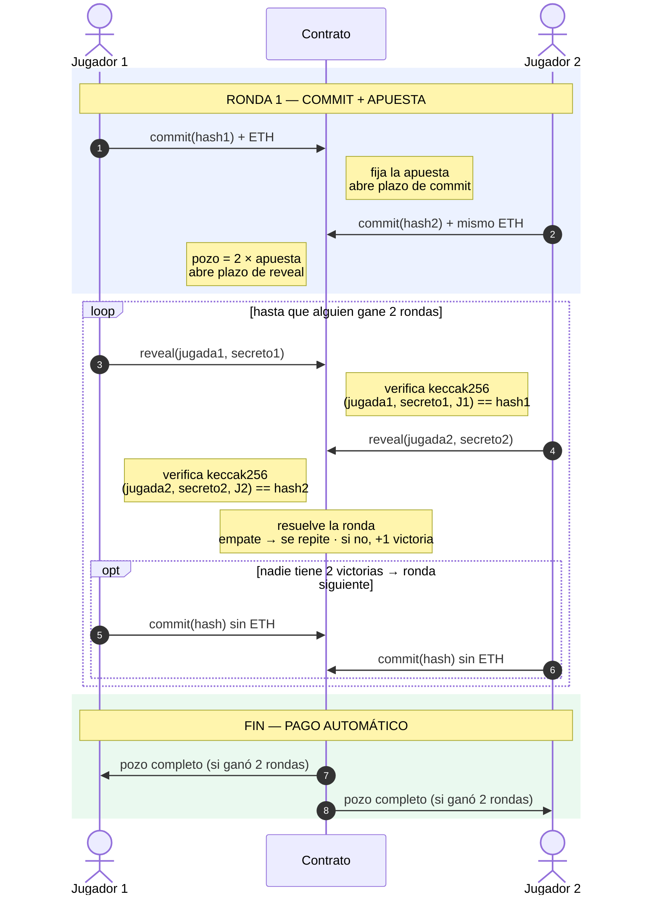
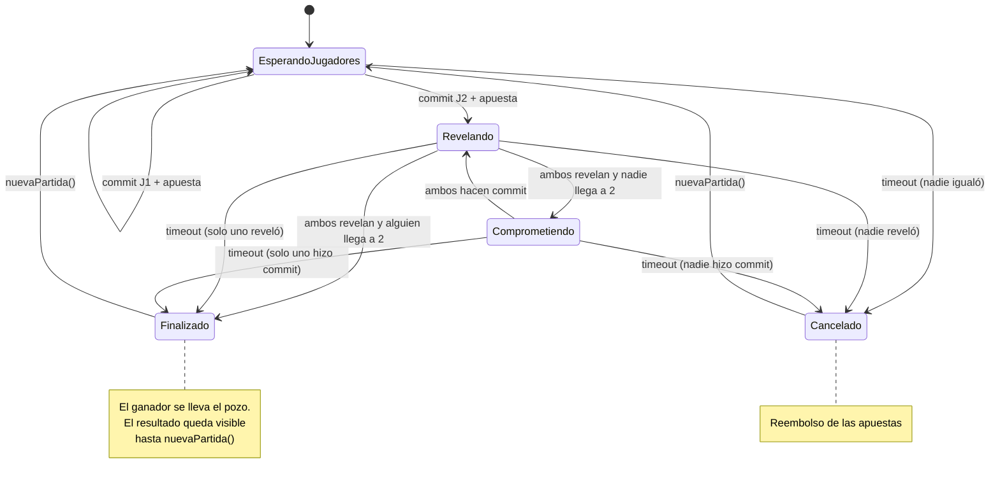

# Cachipún On-Chain — Contrato Inteligente

Evaluación Parcial N°2 · **BCY0010 Fundamentos de Blockchain** · Duoc UC

Contrato inteligente en Solidity que permite a dos jugadores jugar **cachipún (piedra, papel o tijera) al mejor de tres** apostando Ether. Usa el esquema **commit–reveal** para que ninguno pueda ver la jugada del otro antes de comprometerse. Todo se hace en **[Remix IDE](https://remix.ethereum.org)**, en el navegador: no hay que instalar nada.

---

## 1. Flujo del juego



### Paso a paso

| # | Paso | Quién | Qué ocurre en el contrato |
|---|------|-------|---------------------------|
| 1 | **Generar hash** | Cada jugador | Elige un secreto aleatorio de 32 bytes y calcula `keccak256(abi.encodePacked(jugada, secreto, direccion))` con `generarHash`. Es una consulta: no se guarda en la blockchain ni gasta gas. |
| 2 | **Abrir partida** | Jugador 1 | Llama `commit(hash)` enviando ETH (`msg.value`). Queda como J1, fija la `apuesta` y empieza el plazo de commit. |
| 3 | **Unirse** | Jugador 2 | Llama `commit(hash)` con **exactamente** la misma apuesta. Empieza el plazo de revelación. |
| 4 | **Reveal** | Ambos | Llaman `reveal(jugada, secreto)`. El contrato recalcula el hash y lo compara con el guardado; si no coincide, la transacción se revierte. |
| 5 | **Resolución de la ronda** | Automática | Cuando ambos revelaron, el contrato compara las jugadas: si es empate, la ronda se repite; si no, suma una victoria al ganador. |
| 6 | **Rondas siguientes** | Ambos | Mientras nadie tenga 2 victorias: `commit(hash)` **sin ETH** (con un secreto nuevo) y luego `reveal`. |
| 7 | **Pago** | Automático | Al llegar a 2 victorias, el contrato transfiere el pozo (2 × apuesta) al ganador. |
| 8 | **Timeout** | Cualquiera | Vencido un plazo, se llama `reclamarTimeout()` y se aplican las reglas de abajo. El dinero siempre va a los jugadores, nunca a quien llama. |
| 9 | **Nueva partida** | Cualquiera | Con la partida en `Finalizado` o `Cancelado`, `nuevaPartida()` abre la siguiente en el mismo contrato. |

### Reglas de término

| Situación | Resultado |
|-----------|-----------|
| Un jugador gana 2 rondas | Recibe el pozo completo (2 × apuesta) |
| Una ronda termina en empate | La ronda se repite y no suma victorias |
| Ronda 1: nadie iguala la apuesta antes del plazo de commit | Partida anulada: J1 recupera su apuesta |
| Solo un jugador hace commit o revela antes del plazo (cualquier ronda) | **El que no cumplió pierde la partida** (abandono) y el otro se lleva el pozo |
| Ninguno hace commit o revela antes del plazo | **Se anula la partida**: cada uno recupera su apuesta |
| La partida terminó | El fin queda explícito (ver abajo) |

Cómo se hace explícito el fin de una partida:

- El estado `Finalizado` o `Cancelado` se mantiene hasta que alguien llame `nuevaPartida()`.
- Mientras tanto, `commit` revierte con el mensaje *"La partida termino: llama a nuevaPartida()"*.
- El resultado de la última partida (`ganador`, marcador en `victorias` y `porAbandono`) queda legible en el contrato.
- El historial de todas las partidas queda en los eventos `Ganador` y `Anulado`, con su número de partida.

### Diagrama de estados



### Lógica del ganador

Jugadas: `1 = Piedra`, `2 = Papel`, `3 = Tijera`.

```
si j1 == j2                → empate (se repite la ronda)
si (j1 + 3 - j2) % 3 == 1  → gana Jugador 1
si no                      → gana Jugador 2
```

Se suma 3 **antes** de restar porque en Solidity 0.8 una resta que daría negativo revierte (underflow).

---

## 2. Estructura del contrato

Código: [contracts/Cachipun.sol](contracts/Cachipun.sol)

| Elemento | Descripción |
|----------|-------------|
| `enum Jugada { Ninguna, Piedra, Papel, Tijera }` | Jugadas válidas (`Ninguna` se rechaza en el reveal) |
| `enum Estado { EsperandoJugadores, Comprometiendo, Revelando, Finalizado, Cancelado }` | Fase de la partida. `Comprometiendo` es la fase de commit de las rondas 2 en adelante |
| `struct Jugador { addr, jugada, comprometio, revelo, victorias, hash, ultimoSecreto }` | Datos de cada jugador. Los campos chicos van empaquetados en un solo slot de storage |
| `partida`, `ronda` | Número de partida (parte en 1) y ronda dentro de la partida |
| `apuesta` | Monto que fija J1 y que J2 debe igualar |
| `plazoCommit`, `plazoReveal` | Deadlines de la fase en curso, basados en `block.timestamp` |
| `duracionCommit`, `duracionReveal` | Segundos de cada fase. Se fijan en el constructor (mínimo 60) |
| `ganador`, `porAbandono` | Resultado de la última partida. Se mantienen hasta `nuevaPartida()` |
| `pendientes[address]` | Pagos que no se pudieron entregar automáticamente |
| `bloqueDespliegue` | Bloque del despliegue: desde ahí se buscan los eventos en Etherscan |
| `commit(bytes32 hash) payable` | Ronda 1: registra a J1 o J2 con la apuesta. Rondas 2+: guarda solo el hash, sin ETH |
| `reveal(Jugada jugada, bytes32 secreto)` | Verifica el hash, guarda la jugada y resuelve la ronda cuando ambos revelaron |
| `reclamarTimeout()` | Aplica abandono o anulación cuando vence un plazo |
| `nuevaPartida()` | Abre la siguiente partida (solo si la actual terminó) |
| `retirar()` | Cobra un saldo de `pendientes` |
| `generarHash(jugada, secreto, jugador)` `pure` | Calcula el hash del commit. Consultarla no gasta gas |
| `_resolverRonda()`, `_terminar()`, `_anular()`, `_pagar()` (internas) | Ganador de la ronda, cierre de la partida y transferencias de ETH |
| Eventos | `NuevaPartida`, `Commit`, `Reveal`, `RondaGanada`, `Empate`, `Ganador`, `Anulado`, `PagoPendiente` y `Retiro`. Llevan el número de partida (y de ronda) para la trazabilidad en Etherscan |

**Manejo del Ether:**

- La apuesta entra con `msg.value` en el commit de la ronda 1 y queda en el balance del contrato, que es el pozo.
- El contrato no tiene `receive` ni `fallback`, así que no acepta ETH por otra vía.
- El ETH sale solo por `_pagar` (pozo al ganador o reembolsos) o por `retirar`.
- `_pagar` usa `call` con un máximo de 50.000 de gas. Si la transferencia falla, el monto queda en `pendientes` y no bloquea el pago al rival.

---

## 3. Seguridad

| Riesgo | Mitigación |
|--------|------------|
| Un jugador ve la jugada del otro y responde | Commit–reveal: hasta que ambos se comprometen solo se publica el hash |
| Ataque de fuerza bruta al hash (solo 3 jugadas posibles) | Se agrega un **secreto aleatorio de 32 bytes** al hash |
| Copiar el hash del rival (front-running) | La **dirección del jugador** se incluye en el hash, así que un hash copiado no se puede revelar |
| Reutilizar en la ronda siguiente el secreto, que ya es público | El contrato rechaza ese commit (*"Usa un secreto nuevo"*) |
| No revelar (o no hacer commit) para evitar perder | Quien no cumple dentro del plazo **pierde la partida** |
| Bloquear fondos indefinidamente | Plazos de commit y reveal, más `reclamarTimeout()`, que puede llamar cualquiera |
| Reentrancy al transferir | Patrón *checks-effects-interactions* y `nonReentrant` (`ReentrancyGuard` de OpenZeppelin) en **todas** las funciones que escriben, incluida `nuevaPartida`. Así se evita también la reentrada cruzada entre funciones |
| Un receptor que rechaza el ETH o consume todo el gas (DoS) | `_pagar` limita el gas a 50.000 y, si el pago falla, deja el monto en `pendientes` para `retirar()`. El rival cobra igual |
| Manipulación de `block.timestamp` por los validadores | Los plazos son de minutos (mínimo 60 s) y la variación posible es de segundos |
| Apuestas desiguales | J2 debe enviar exactamente `apuesta`; en las rondas 2+ `msg.value` debe ser 0 |
| Terceros interfiriendo | En las rondas 2+, `commit` y `reveal` solo aceptan a las 2 direcciones registradas |
| Filtrar el secreto al calcular el hash | En Sepolia, consultar `generarHash` envía el secreto al nodo RPC antes del reveal. Por eso el hash se calcula en **Remix VM**, que corre dentro del navegador: `generarHash` es `pure` y da el mismo resultado sin conectarse a ninguna red |
| ETH enviado por error al contrato | No hay `receive` ni `fallback`, así que la transacción revierte |

Las reglas se pueden comprobar a mano en Remix VM: cambiar la jugada, apostar distinto, repetir el secreto, jugar con una tercera cuenta y los timeouts (ver [DESPLIEGUE.md](DESPLIEGUE.md), paso 4).

**Riesgos residuales:**

- **Las jugadas y los secretos quedan públicos para siempre** una vez revelados. Es intencional, porque permite la auditoría.
- **El secreto lo guarda cada jugador:** si lo pierde antes de revelar, no puede revelar y pierde la partida. Hay que anotarlo apenas se genera.
- **Reutilizar un secreto entre partidas distintas** no lo detecta el contrato, que solo compara con la ronda anterior. Hay que generar un secreto nuevo para cada ronda.
- **Cerrar una partida abandonada cuesta gas:** alguien debe llamar `reclamarTimeout()`. El incentivo lo tiene quien cumplió, porque cobra el pozo.

**Llaves y wallets:**

- **Firma:** cada transacción se firma con la llave privada del jugador (ECDSA sobre secp256k1). En Sepolia la firma MetaMask; en Remix VM, las cuentas de prueba del simulador. La red verifica la firma y el contrato obtiene la identidad vía `msg.sender`, la dirección derivada de la llave pública.
- **Solo el dueño revela:** el hash incluye la dirección del jugador y `reveal` lo recalcula con `msg.sender`. Así, solo el dueño de la wallet puede revelar su jugada.
- **El premio va a la wallet que jugó:** se paga a esa misma dirección.

---

## 4. Cómo ejecutarlo

Todo se hace en **Remix IDE**. La guía paso a paso está en **[DESPLIEGUE.md](DESPLIEGUE.md)**:

1. **Compilar** el contrato en Remix.
2. **Jugar en Remix VM**, una blockchain simulada en el navegador con cuentas de 100 ETH falsos. Incluye una partida de ejemplo y una tabla de hashes listos para copiar.
3. **Probar las reglas:** trampas y timeouts.
4. **Desplegar en Sepolia** para la entrega, desde el mismo Remix con MetaMask. La rúbrica pide el contrato desplegado en una testnet.

**Dirección del contrato en Sepolia:** `0x...` *(completar)*

### Archivos

```
contracts/Cachipun.sol   contrato del juego (se abre, compila y despliega en Remix)
DESPLIEGUE.md            guía paso a paso en Remix
Rúbrica.pdf              pauta de la evaluación
```

---

## 5. Costos de gas

Solidity 0.8.28 **sin optimizador** y EVM `cancun`, la configuración por defecto de Remix. Es el gas total de cada transacción, incluidos los 21.000 de base. En Remix se ve en la terminal como *transaction cost* y puede variar en unos pocos gas.

| Operación | Gas |
|-----------|----:|
| Desplegar el contrato | 2.960.116 |
| `commit` de J1 en la ronda 1 (abre y apuesta) | 123.171 |
| `commit` de J2 en la ronda 1 (iguala la apuesta) | 127.658 |
| `reveal` que no cierra la ronda | 52.419 – 69.519 |
| `reveal` que resuelve la ronda | 91.511 |
| `reveal` que resuelve la ronda y paga el pozo | 79.182 |
| `commit` en rondas 2+ (sin ETH) | 55.304 – 63.787 |
| `reclamarTimeout()` que anula y reembolsa a ambos | 60.143 |
| `nuevaPartida()` | 73.386 |
| **Partida completa 2-0** (8 transacciones) | **≈ 662.500** |

- **Reutilizar el contrato sale ~40 veces más barato que redesplegar.** Abrir una partida con `nuevaPartida()` cuesta 73.386 de gas; desplegar un contrato nuevo, 2.960.116.
- **El costo no crece con el número de partidas.** La partida 2 costó lo mismo que la 1 (662.551 contra 662.527). Ninguna función recorre listas ni el historial, y leer o escribir un `mapping` cuesta lo mismo sin importar cuántas entradas tenga.
- **Las rondas 2+ son más baratas que la 1.** Reescriben slots que ya tenían datos (unos 5.000 de gas cada uno) en vez de ocupar slots nuevos (unos 22.100).
- **El historial va en eventos y no en storage.** Guardar el resultado de cada partida en un `mapping` costaría unos 90.000 de gas por partida (estimado: 4 slots nuevos); un evento cuesta unos 2.000–3.000 y queda igual de permanente y auditable en Etherscan. El contrato guarda solo el resultado de la última partida, que es lo que necesita para dejar explícito que terminó.
- **Quién paga:** cada transacción la paga quien la envía; el contrato no paga gas.
  - El despliegue lo paga quien despliega.
  - `nuevaPartida()` y `reclamarTimeout()` las paga quien las llame.
  - En ETH, el costo es gas × precio del gas: a 1 gwei, una partida completa cuesta ≈ 0,00066 ETH entre ambos jugadores. En Sepolia se paga con ETH de faucet; en Remix VM, con ETH falso.

---

## 6. Entregables (según rúbrica)

- [ ] Contrato en Solidity desplegado en testnet (desde Remix con MetaMask)
- [ ] Informe técnico PDF (8–10 págs., Arial/Calibri 11, interlineado 1.5, APA 7, capturas de despliegue y ejecución)
  - [ ] Flujo de transacciones y seguridad — IE1, IE2
  - [ ] Funcionamiento como DApp y análisis de seguridad — IE4, IE5
  - [ ] Desarrollo del contrato inteligente — IE8, IE9
- [ ] Pitch NABC de 5 min (PPT/PDF)
  - [ ] **Need:** confianza en apuestas entre desconocidos
  - [ ] **Approach:** flujo de transacciones y procedimiento del contrato — IE3, IE10
  - [ ] **Benefit:** automatización y transparencia — IE6
  - [ ] **Defensa:** auditoría y trazabilidad — IE7
- [ ] Dirección del contrato + enlace a este repositorio en AVA

## Herramientas

Remix IDE · MetaMask · Sepolia · Etherscan · OpenZeppelin
